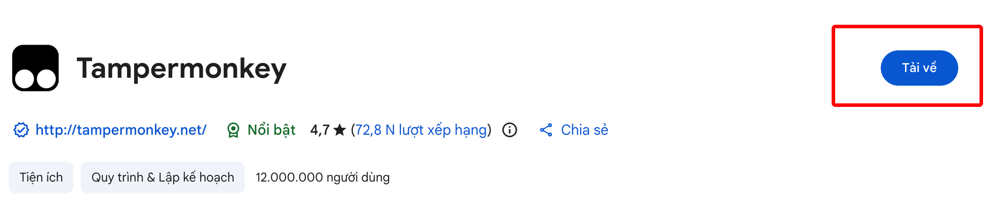
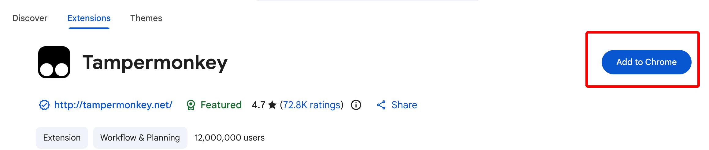
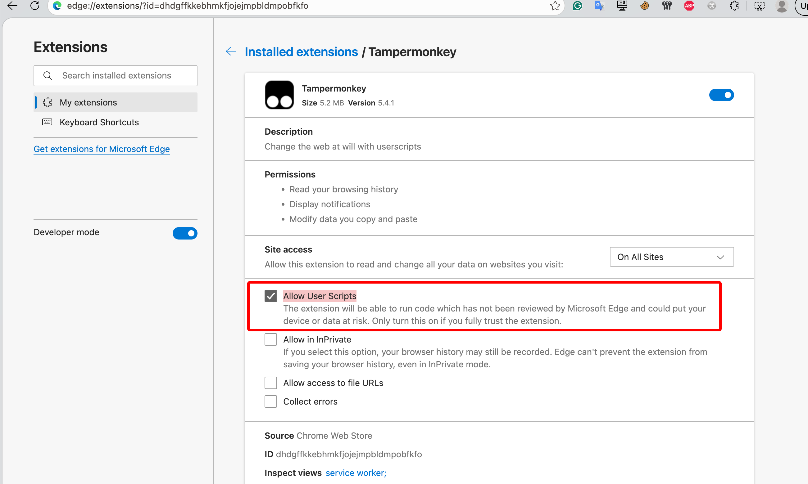
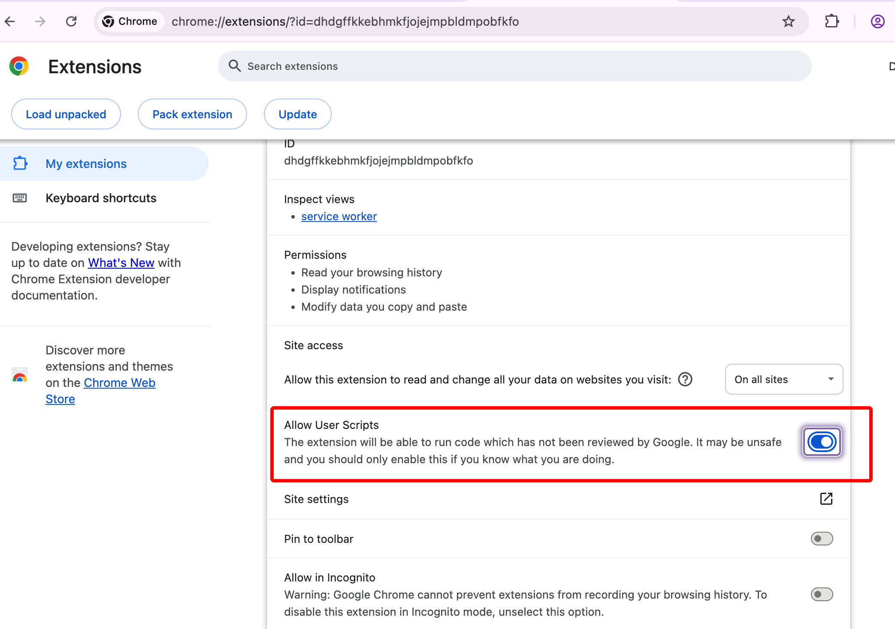
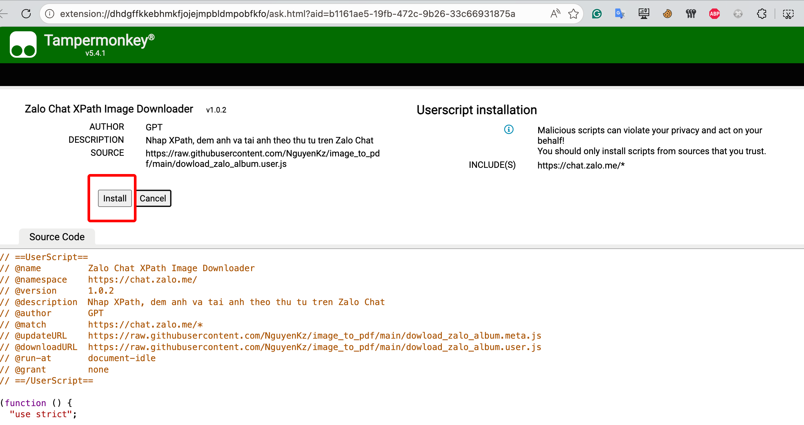

# Install Download Zalo Album userscript

## Install Tampermonkey

1. Download Tampermonkey from [Tampermonkey Chrome Web Store](https://chromewebstore.google.com/detail/tampermonkey/dhdgffkkebhmkfjojejmpbldmpobfkfo) 
   - 
   - 

2. Install Tampermonkey
3. Enable Tampermonkey

   1. For Microsoft Edge, open `edge://extensions/`
      1. Click Enable Developer Mode 
      2. Go to [Tampermonkey Edge Extension](edge://extensions/?id=dhdgffkkebhmkfjojejmpbldmpobfkfo)
      3. Click "Allow User Scripts" 
      4. Done
   2. For Google Chrome, open `chrome://extensions/`
      1. Click Enable Developer Mode 
      2. Go to [Tampermonkey Chrome Extension](chrome://extensions/?id=dhdgffkkebhmkfjojejmpbldmpobfkfo)
      3. Click "Allow User Scripts" 
      4. Done

## Install userscript

1. Open [Download Zalo Album userscript](https://raw.githubusercontent.com/NguyenKz/image_to_pdf/main/dowload_zalo_album.user.js)
2. Click "Install" or "ReInstall" 
3. Done
